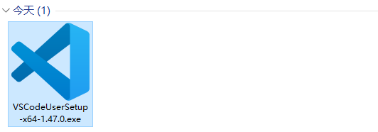

# vscode安装

## 简介

> Visual Studio Code (简称 VSCode / VSC)  是一款免费开源的现代化轻量级代码编辑器，支持几乎所有主流的开发语言的语法高亮、智能代码补全、自定义热键、括号匹配、代码片段、代码对比  Diff、Git 等特性，支持插件扩展，并针对网页开发和云端应用开发做了优化。软件跨平台支持 Win、Mac 以及  Linux，运行流畅，可谓是微软的良心之作……

## Part one

### 下载

请根据自己的实际情况下载：

> 下载地址：
>  https://code.visualstudio.com/Download

下面以Window10(专业版 64)为例。下载成功之后的文件截图：
 

## Part two

### 安装

> 1.双击.exe文件，点击‘ 运行 ’按钮
>  
>  2.点击接受协议，然后点击 ‘ 下一步 ’
>  
>  \3. 选择安装位置，点击‘ 下一步 ’
>  
>  \4. 根据个人习惯，决定是否将程序添加到菜单栏，执行下一步
>  ps: 个人不喜欢创建开始菜单文件夹，所以将蓝色框部分勾选。
>  
>  5.选择快捷方式，点击‘ 下一步 ’
>  
>  \6. 安装
>  
>  \7. 安装过程及结果
>  
>  

## Part three

### 简单配置

> #### 首次启动
>
> 
>
> #### 设置语言支持
>
> 快捷键：ctrl + shift + p
>  
>  点击使用：
>  
>  选择期望使用的语言包
>  
>  语言包安装成功之后，需要重启VSCode
>  
>  重启成功之后，界面信息：
>  
>
> #### 安装插件
>
> 略

> #### 使用文档
>
> 在’ 帮助 '–> ’ 文档 ’ 即可访问使用说明。
>地址：
> https://code.visualstudio.com/docs#vscode

### 资料来源

> vscode文档:
>  https://code.visualstudio.com/docs#vscode
>  wamp server:
>  https://www.wampserver.com/
>  /
>  **关于Git的配置，比较简单，有需要的请移步自行百度[这里](https://www.baidu.com/s?ie=utf-8&f=3&rsv_bp=1&rsv_idx=2&tn=baiduhome_pg&wd=vscode git配置&rsv_spt=1&oq=wampserver&rsv_pq=fe15cfc10002ffd2&rsv_t=2b25vcSIipzhVGYumjfC2GkfH99SV%2FgwpeL3DBwV1KCHhR3PeG7mHsm7bn9%2FtJQp9wca&rqlang=cn&rsv_enter=0&rsv_dl=ts_1&rsv_btype=t&inputT=8779&rsv_sug3=66&rsv_sug1=38&rsv_sug7=100&rsv_sug2=1&prefixsug=vscode%20git&rsp=1&rsv_sug4=8780)**（个人建议：还是使用手敲git命令的方式来处理版本控制比较有助于加深自己对 git 的理解）
>  /
>  **关于快捷键，大家可以在 “文件”–> “首选项” --> "键盘快捷方式"里面搜索和查看自己需要的内容。**
>  /
>  感谢阅读，祝工作顺利！