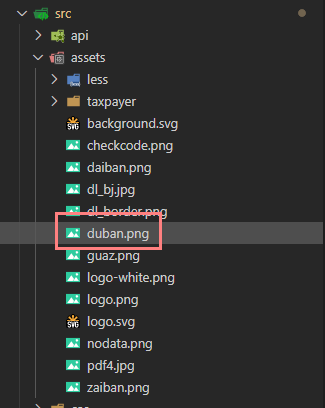
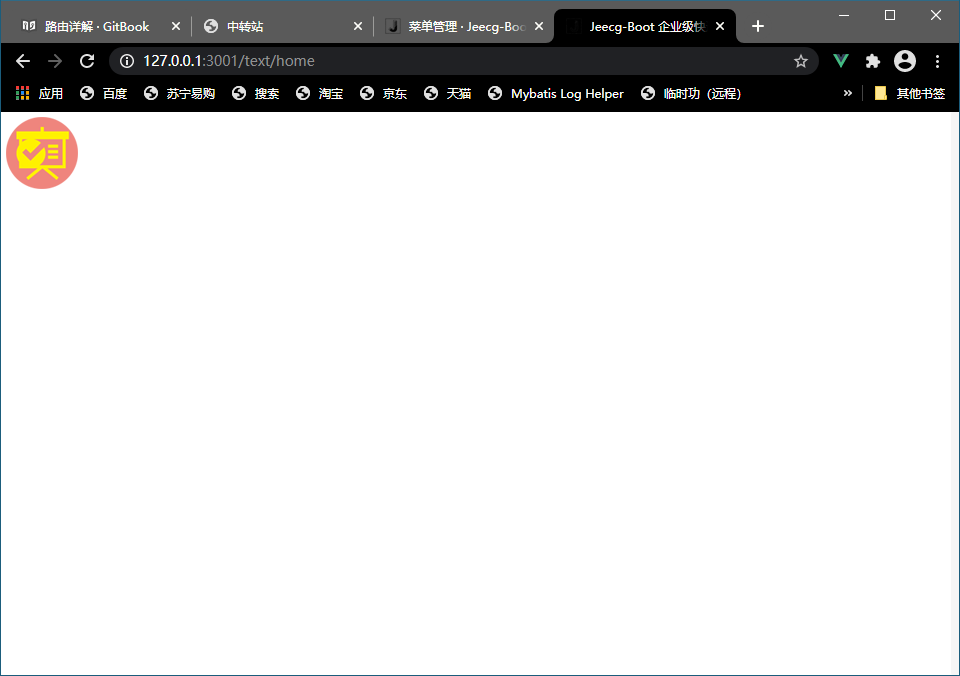
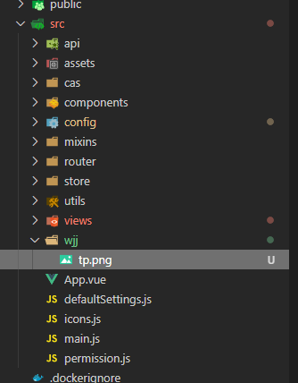

# 第三节：静态资源

在vue页面中如何引用静态资源（css，img，js，等，不推荐引入非vue版本的js）

静态资源放在assets或static，

### 资源路径前缀

| 前缀   | 路径  |
| ---- | ------- |
| @$   | src  |
| @api | src/api |
| @assets | src/assets |
| @comp | src/components |
| @views | src/views |
| @layout | src/layout |
| @static | src/static |
| @mobile | src/modules/mobile |

如：想再home也显示一个静态的图片，

图片存放在



```vue
<template>
  <div>
    
  </div>
</template>

<script>
export default {
  name: 'text_vue',
  data () {
    return {}
  },
}
</script>

<style scoped>

</style>
```



引入css

```vue
<style scoped>
  @import '~@assets/less/common.less'
</style>
```

在css里引入静态资源

```vue
<template>
  <div>
    {{targetTime}}
    <br>
    <router-link :to="{name:'text_list'}">跳转到list页</router-link>
    <br>
    <a @click="toList">跳转到list页</a>
    <br>
    
    <div class="tp" style="width:150px;"></div>
  </div>
</template>

<script>
export default {
  name: 'text_vue',
  data () {
    return {
      targetTime: new Date().getTime() + 3900000
    }
  },
  methods:{
    toList(){
      this.$router.push({ name: "text_list" })
    },
  }

}
</script>

<style scoped>
  .tp{
    height: 50vh;
    background-image: url(~@/wjj/tp.png);
  }
</style>
```



在css引用与在<template>中引用不一样，使用的是~@/作为根目录，