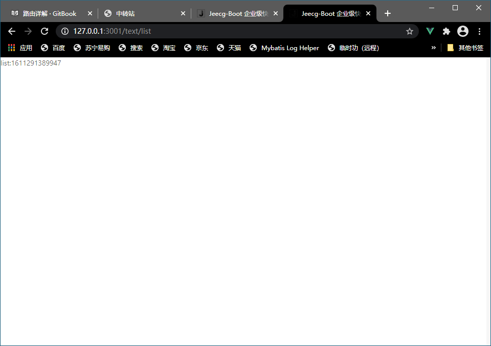

# 第二节：路由

## 静态路由

<span id="staticRouter">[src\config\router.config.js]</span>

constantRouterMap变量里面，配置路由

例如：

```js
  {
    path: '/tax',
    name: 'taxpayer',
    //component: BlankLayout,
    component: () => import('@/views/taxpayer/taxLayout'),
    meta: { title: '首页' },
    redirect: '/tax/home',
    children: [
      {
        path: "home",
        name: "taxpayer_home",
        component: () => import('@/views/taxpayer/index'),
        meta: { title: '首页', permission: [ 'user' ] }
      },
      {
        path: "search",
        name: "taxpayer_search",
        component: () => import('@/views/taxpayer/search'),
        meta: { title: '搜索页', permission: [ 'user' ] }        
      },
      {
        path: "chaxunlist",
        name: "taxpayer_chaxunlist",
        component: () => import('@/views/taxpayer/chaxunlist'),
        meta: { title: '列表页', permission: [ 'user' ] }
      },
      {
        path: "chaxundetail",
        name: "taxpayer_chaxundetail",
        component: () => import('@/views/taxpayer/chaxundetail'),
        meta: { title: '详情页', permission: [ 'user' ] }
      },
    ]
  },
```

`{ Route }` 对象

| 参数     | 说明                                      | 类型    | 默认值 |
| -------- | ----------------------------------------- | ------- | ------ |
| hidden   | 控制路由是否显示在 sidebar                | boolean | falase |
| redirect | 重定向地址, 访问这个路由时,自定进行重定向 | string  | -      |
| name     | 路由名称, 建议设置,且不能重名             | string  | -      |
| meta     | 路由元信息（路由附带扩展信息）            | object  | {}     |

`{ Meta }` 路由元信息对象

| 参数                | 说明                                                         | 类型    | 默认值 |
| ------------------- | ------------------------------------------------------------ | ------- | ------ |
| title               | 路由标题, 用于显示面包屑, 页面标题 *推荐设置                 | string  | -      |
| icon                | 路由在 menu 上显示的图标                                     | string  | -      |
| keepAlive           | 缓存该路由                                                   | boolean | false  |
| hiddenHeaderContent | *特殊 隐藏 [PageHeader](https://github.com/sendya/ant-design-pro-vue/blob/master/src/components/layout/PageHeader.vue#L14) 组件中的页面带的 面包屑和页面标题栏 | boolean | false  |
| permission          | 与项目提供的权限拦截匹配的权限，如果不匹配，则会被禁止访问该路由页面 | array   | []     |


## 创建

创建【src\views\text\index.vue】文件

```vue
<template>
  <div>
    {{targetTime}}
  </div>
</template>

<script>
export default {
  name: 'text_vue',
  data () {
    return {
      targetTime: new Date().getTime() + 3900000
    }
  },
}
</script>

<style scoped>

</style>
```

配置/text的路由

```js
  {
    path: '/text',
    name: 'text',
    component: () => import('@/views/text'),//如果页面是index.vue,则可以省略，.vue也可以省略
    meta: { title: '首页' },
  },
```

访问【http://localhost:3001/ text】(需要登录，免登陆有些问题实现不出来)


如果其下还有子页可以这样配置

```js
  {
    path: '/text',
    name: 'text',
    hidden: true,
    redirect: '/text/home',
    component: BlankLayout,//空布局，如果需要定制此页面的样式，则需要将@/components/layouts/*的布局复制一份，再引入
    children: [
      {
        path: 'home',
        name:'home',
        component: () => import('@/views/text'),//如果页面是index.vue,则可以省略，.vue也可以省略
        meta: { title: 'home' },
      },
    ]
  },

```

其中【redirect】指定了访问/text跳转到/text/home路由里，而/text/home指定了具体的页面@/views/text，隐式的指定了其文件夹下的index.vue文件

如果还存在一个子路由

先新建个vue文件

在text文件夹下再创建个list.vue

```vue
<template>
  <div>
    list:{{targetTime}}
  </div>
</template>

<script>
export default {
  name: 'text_vue',
  data () {
    return {
      targetTime: new Date().getTime() + 3900000
    }
  },

}
</script>

<style scoped>

</style>
```

再配置路由

```js
  {
    path: '/text',
    name: 'text',
    hidden: true,
    redirect: '/text/home',
    component: BlankLayout,//空布局，如果需要定制此页面的样式，则需要将@/components/layouts/*的布局复制一份，再引入
    children: [
      {
        path: 'home',
        name:'home',
        component: () => import('@/views/text'),//如果页面是index.vue,则可以省略，.vue也可以省略
      },
      {
        path: 'list',
        name:'list',
        component: () => import('@/views/text/list'),
      },
    ]
  },

```

访问【http://localhost:3001/ text/list】




## 动态路由

动态路由是使用系统菜单创建的路由

与[静态路由](#staticRouter)的配置填写的内容

具体操作再补充

[官方文档对于菜单配置的说明](http://doc.jeecg.com/2043933)


## 页面内跳转路由

从text/index跳转到text/list

index页改为

```vue
<template>
  <div>
    {{targetTime}}
    <br>
    <router-link :to="{name:'text_list'}">跳转到list页</router-link>
    <br>
    <a @click="toList">跳转到list页</a>
  </div>
</template>

<script>
export default {
  name: 'text_vue',
  data () {
    return {
      targetTime: new Date().getTime() + 3900000
    }
  },
  methods:{
    toList(){
      this.$router.push({ name: "text_list" })
    },
  }

}
</script>

<style scoped>

</style>
```


其中的name即为路由中配置的name

@click为a标签添加个点击事件

传参路由跳转

略

