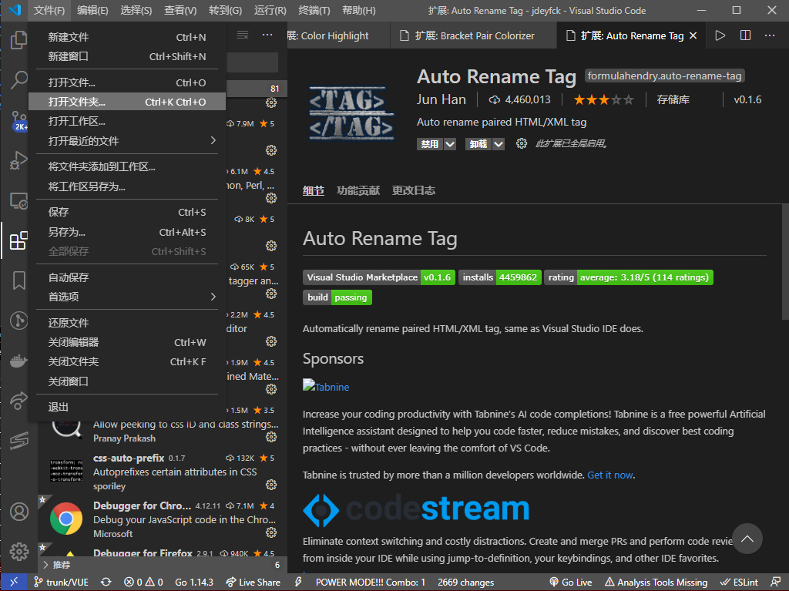

# 第一节：jeecg-vue环境的搭建

这里我们使用vscode作为演示

## 准备工作

  [安装node.js](envinstall/nodejs/nodejs.md)
  [安装vsode](envinstall/ide/vscode/README.md)

## 安装插件


### 安装Vetur

  支持Vue


点击安装即可

### 安装Ant Design Vue helper

支持ant design vue提示


## 导入vscode

点击 `文件`->`打开文件夹`




选择已经下载好的`jeecg-vue`项目


打开后


## 初始化安装

打开`NPM 脚本`


再点击`NPM 脚本`,找到里面的pre，点击运行


## 初始化安装（使用cmd）

或者使用```cmd```命令进行安装, `这种方法和上面的方法任选其一`


使用 <kbd>Ctrl</kbd>+<kbd>`</kbd> 打开终端

如果打开的是`power shell`,可以更改为`cmd`(`power shell与cmd有些语法上的不同，建议使用cmd`)

选择`cmd.exe`，关闭窗口再次打开即可


再>后面输入`init` [^1]或者是`npm run pre` [^2]，这两个任选其一

[^1]: 一个cmd脚本，运行即可安装yarn 并使用yarn初始化安装（使用本地的服务器，速度较快，仅支持cmd推荐使用）
[^2]: 用npm执行package.json中的pre脚本，jeecg-vue自带的

## 启动

### 使用`NPM 脚本`启动

点击`serve`的三角号启动


如下显示，即为启动成功


点击垃圾桶即可停止

### 使用`cmd`启动

使用 <kbd>Ctrl</kbd>+<kbd>`</kbd> 打开终端

输入 `run`或`yarn serve`或`npm run serve`启动服务


# 推荐安装插件

- Eclipse Keymap
  切换为ecliplse快捷键,*也可以更改为其他熟悉的快捷键*

  

- Git History
  点击任意一行查看git历史

  

- Path Intellisense
  地址提示

  

- Guides
  显示辅助线

  

- Color Highilght
  显示css颜色

  

- Bracket Pair Colorizer
  彩色括号，成对的一个颜色

  

- Auto Rename Tag
  自动补全html/xml标签

  

  